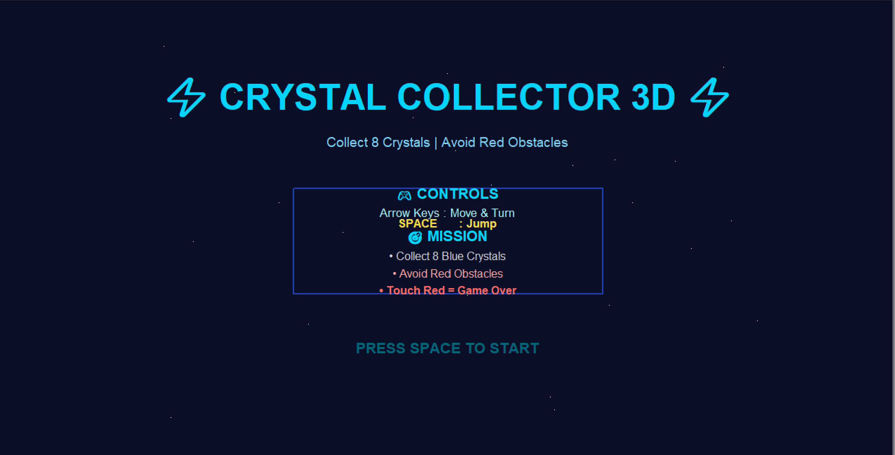
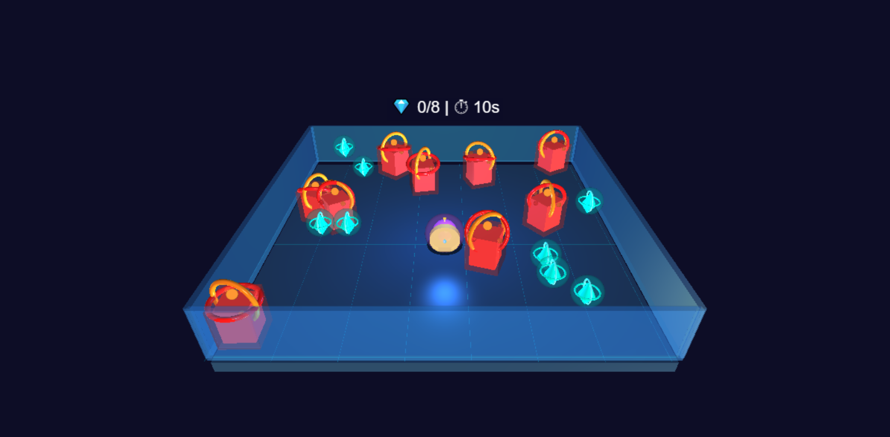

# 🎮 Crystal Collector 3D - Ultimate Professional Edition

## 📌 Project Overview

**Crystal Collector 3D** is an interactive 3D game developed using Python.
This project is created as part of **Human Computer Interaction (HCI)** and **Computer Graphics** coursework.

The game provides a smooth user interface, engaging gameplay, and a visually appealing 3D environment where players collect crystals while avoiding obstacles.

---

## 🎯 Objectives

* Design an interactive and user-friendly interface (HCI principles)
* Implement real-time user controls
* Create a 3D environment using graphics concepts
* Enhance user experience with animations and visual effects

---

## 🕹️ Game Features

* 🎨 Professional animated start menu (Turtle GUI)
* 🌌 3D game environment using VPython
* 👤 Player movement with smooth controls
* 💎 Crystal collection system
* 🚫 Moving and rotating obstacles
* ✨ Visual effects (glow, animation, lighting)
* 🏆 Victory & Game Over screens

---

## 🎮 Controls

| Key            | Action        |
| -------------- | ------------- |
| ⬆️ Arrow Up    | Move Forward  |
| ⬇️ Arrow Down  | Move Backward |
| ⬅️ Arrow Left  | Turn Left     |
| ➡️ Arrow Right | Turn Right    |
| SPACE          | Jump          |

---

## 🛠️ Technologies Used

* Python
* Turtle (for UI/Menu)
* VPython (for 3D Graphics)
* Object-Oriented Programming (OOP)

---

## 🧠 HCI Concepts Applied

* User-centered design
* Visual feedback (glow effects, animations)
* Consistent UI layout
* Clear instructions and controls
* Interactive navigation

---

## 📂 Project Structure

```
Crystal-Collector-3D/
│── 3D.py
│── README.md
```

---

## ▶️ How to Run

1. Install Python (3.x)
2. Install VPython:

   ```
   pip install vpython
   ```
3. Run the file:

   ```
   python 3D.py
   ```

---

## 📸 Screenshots

### 🟢 Game Menu



### 🔵 Gameplay




## 🚀 Future Improvements

* Add sound effects 🎵
* Add multiple levels
* Score leaderboard system
* Difficulty modes

---

## 👩‍💻 Author

**Samra Ramzan**
BSCS Student

---

## ⭐ Conclusion

This project demonstrates the integration of **HCI principles** with **Computer Graphics** to create an engaging and user-friendly gaming experience.

---

✨ *Thank you for playing Crystal Collector 3D!*
